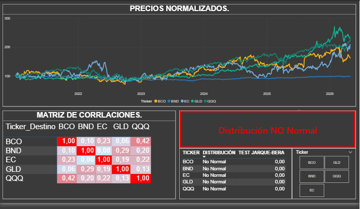
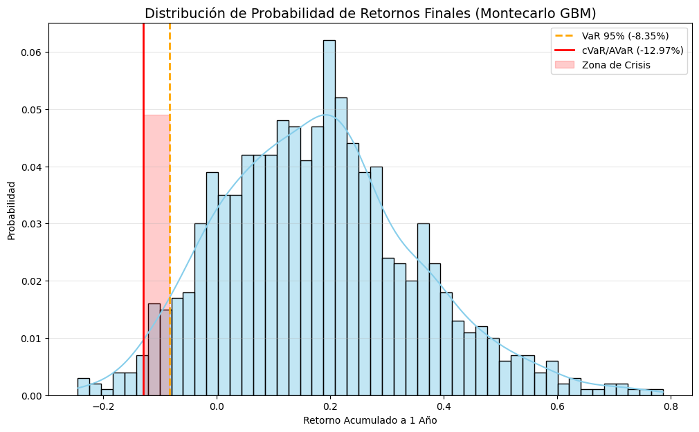
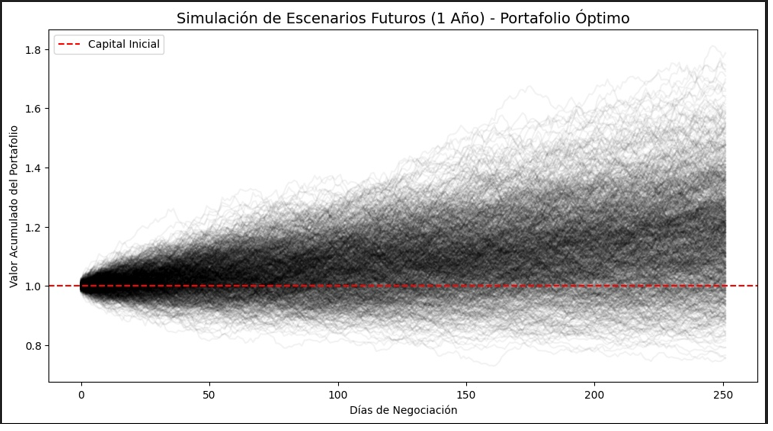
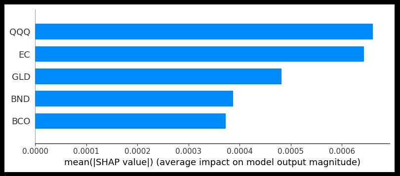
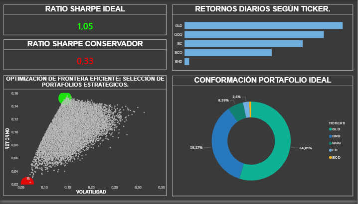
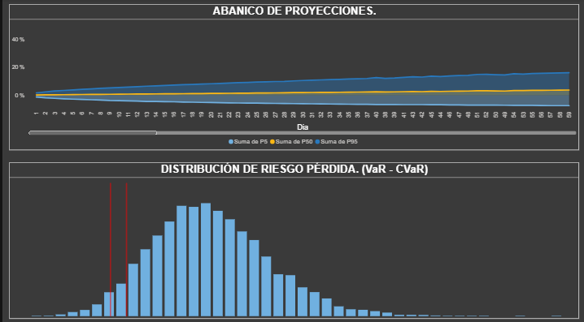

# **DYNAMICS FINANCIAL FORECASTING: MODELADO ESTRATÉGICO Y PROYECCIÓN 2026**
**Autor:** Julián Esteban León Ospina

## **Descripción del Proyecto**
Este ecosistema de inteligencia financiera integra modelos probabilísticos y técnicas de optimización para proyectar el desempeño organizacional hacia 2026. Combinamos **Simulaciones de Monte Carlo**, **Optimización de Portafolios (Markowitz)** y **Machine Learning Explicable** para transformar la incertidumbre del mercado en una hoja de ruta estratégica para la alta gerencia.

---

## **Estructura del Ecosistema Analítico**

### **1. Parte I: Diagnóstico Estratégico y Robustez (EDA)**
* **Validación Estadística:** Análisis de normalidad (Jarque-Bera) y estabilización de varianza en series financieras.
* **Correlación Macroeconómica:** Evaluación de la sensibilidad de los activos frente a la volatilidad de la TRM.
* **Calidad de Datos:** Identificación de outliers y tratamiento de ruido en datos transaccionales.

### **2. Parte II: Modelado Predictivo y Riesgo (ML)**
* **Simulación Estocástica:** Implementación de **Geometric Brownian Motion (Monte Carlo)** para proyecciones de activos.
* **Análisis de Riesgo:** Cuantificación de pérdida potencial mediante **VaR (Value at Risk)** y **CVaR**.
* **Interpretabilidad:** Uso de **SHAP Values** para entender los pesos de cada variable en el rendimiento proyectado.

### **3. Parte III: Business Intelligence & Portfolio Optimization**
* **Frontera Eficiente:** Visualización del set de portafolios óptimos bajo la teoría moderna de Markowitz.
* **Executive Summary:** Tableros de control en Power BI diseñados para la gestión de activos y monitoreo de retornos esperados.

---

## **4. Recorrido Visual: Dashboards e Insights Técnicos**
> **Ubicación de recursos:** `/images/` y `/dashboards/Financial_Forecasting.pbix`

### **Fase 1: Diagnóstico y Robustez de Datos**

> **Insight Técnico:** Análisis de calidad donde validamos la no-normalidad mediante la **prueba de Jarque-Bera**. Este paso justifica el uso de modelos estocásticos en lugar de proyecciones lineales simples.

---

### **Fase 2: Modelado de Riesgo y Proyección Estocástica**

| Referencia | Visualización | Descripción Técnica |
| :--- | :--- | :--- |
| **Riesgo Extremo** |  | **Simulación Monte Carlo:** Proyección de 10,000 escenarios. Identificamos el **VaR** y el **CVaR**, detectando la 'Zona de Crisis' para protección de capital. |
| **Forecasting** |  | **Abanico de Probabilidades:** Representación visual de la tendencia central y la dispersión esperada del portafolio hacia 2026. |
| **Explicabilidad** |  | **IA Explicable (SHAP):** Desglose del impacto de cada activo en el modelo, asegurando transparencia en la selección de la estrategia. |

---

### **Fase 3: Optimización Estratégica (Power BI)**

| Referencia | Visualización | Valor para la Alta Gerencia |
| :--- | :--- | :--- |
| **Estrategia** |  | **Optimización de Markowitz:** Identificación del portafolio que maximiza el **Sharpe Ratio**. Es el punto de decisión para la asignación de recursos. |
| **Eficiencia** |  | **Matriz de Rendimiento:** Comparativa visual entre activos para detectar desviaciones en el desempeño esperado. |

---

## **Tecnologías Utilizadas**
* **Lenguaje:** Python (Pandas, Statsmodels, Scikit-Learn, PyPortfolioOpt).
* **Modelado:** Monte Carlo, Holt-Winters, Sharpe Optimization.
* **Visualización:** Power BI (DAX Avanzado) y Matplotlib/Seaborn.
* **Entorno:** Jupyter Notebooks para validación estadística.

## **Insights Principales**
1. **Optimización de Riesgo:** La diversificación basada en la frontera eficiente reduce la exposición al riesgo de cola en un entorno de alta volatilidad.
2. **Sensibilidad TRM:** Se confirma una correlación directa que permite usar ciertos activos como cobertura natural ante la devaluación.
3. **Decisión Basada en Datos:** El modelo permite pasar de una gestión reactiva a una proactiva mediante el monitoreo constante de los rangos de confianza.
